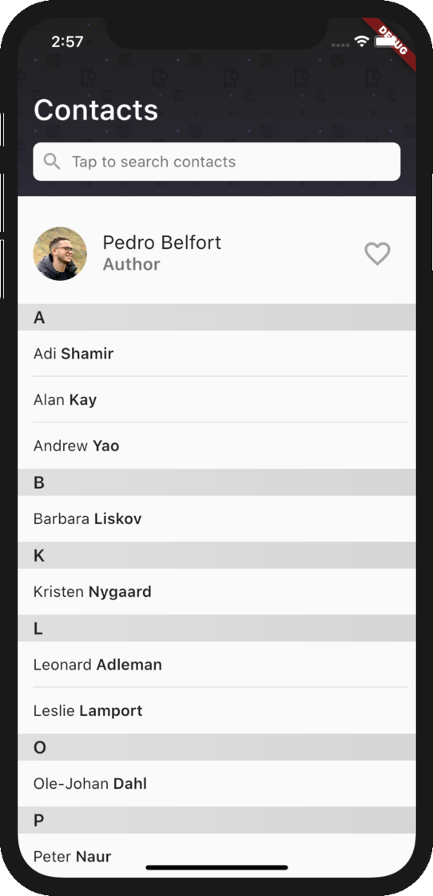
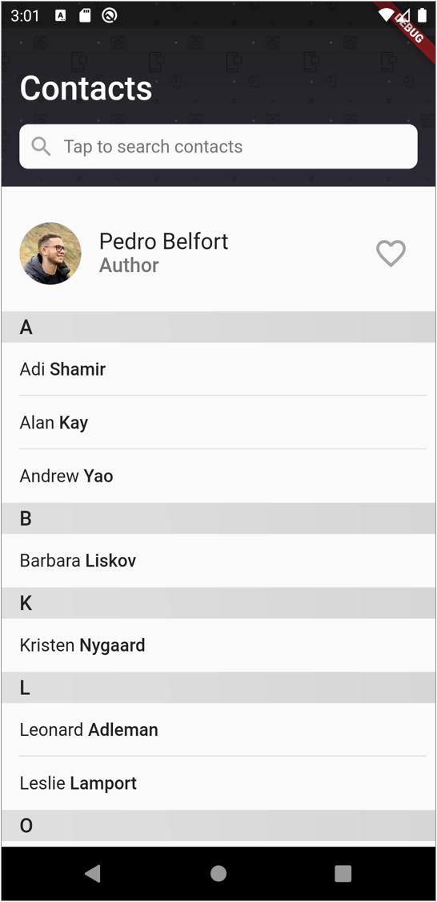
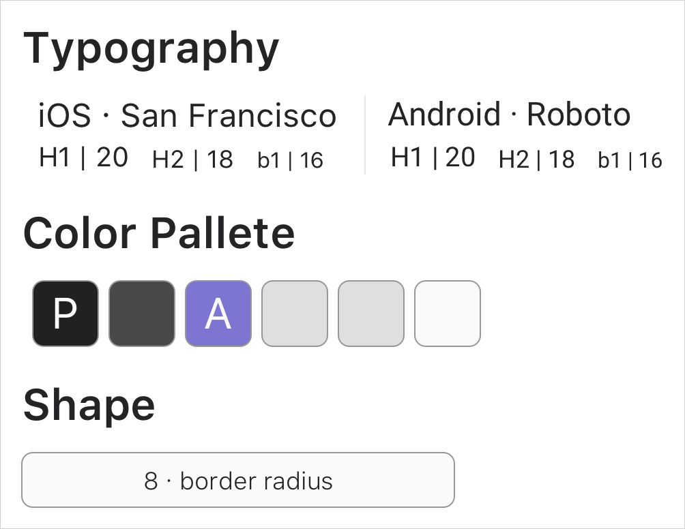
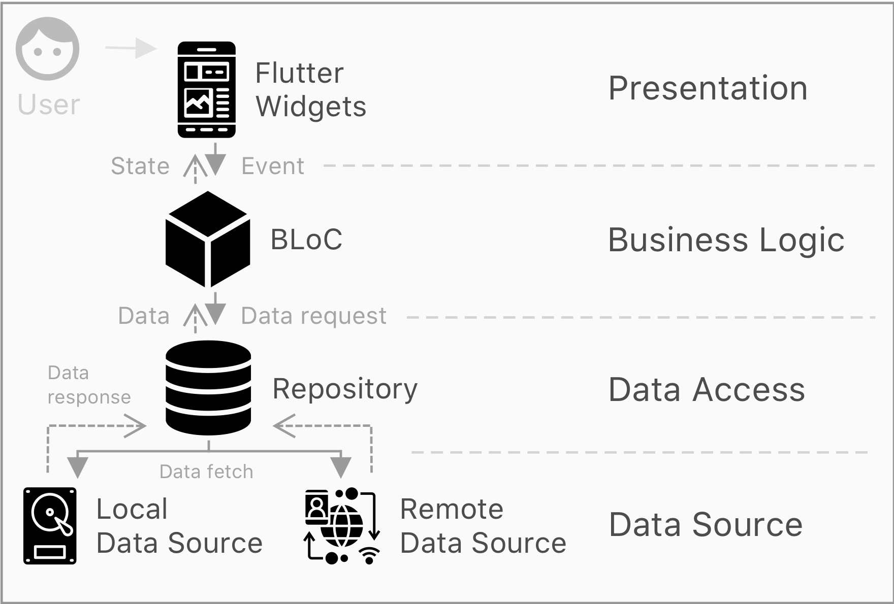

<h1 align="center">
  
   
   
  Flutter Coding Challenge
   
</h1>

  
  

## Requirements

> Given a list of contact names (as `List<String>` for demo purposes), render an address book list where the names are grouped by their first character.

### Basic

- [x] Implementation should be done in its own Widget
    - [x] We expect a `GroupedListView` widget which receives the items
    - [x] Make this widget generic and be able to work with any data type, given the appropriate builder is provided
    - [x] It should be a single, continuous list widget
        - [x] Preferably this scroll view should be using `Slivers` and a `CustomScrollView`
    - [x] In the end, all data should be displayed in one continuous scrolling list
    - [x] Only visible items should be rendered (expect huge amounts of test data and a requirement to show images next to each contact)
- [x] Use any styling you want, stock Material widgets are fine
- [x] Only show groups that have entries
- [x] Each entry should be tappable (next screen may just show the name in "detail view"

### Additional

- [x] There should be the ability to show widgets on the top and below the list
    - For this challenge, we only want to inject a vertical list of buttons
- [x] A search field should be provided to filter down the list
    - [x] When a search is active, the additional widgets should be hidden
- [x] Describe why a Scroll to index API is not as straightforward with normal `ListView` or `Sliver` widgets in the README of the project
- [x] Please finish your coding challenge with a short README outlining your thinking behind the implementation and any open issues you would want to explore if there were more time.

## Implementation

### Design

The app's primary goal is to **display a list of contacts** provided by either a local or remote data source. Users also have the ability to **search** for specific contacts from the list or tap on tiles to **access further information**.

The graphical user interface and experience were tailored with the [Material](https://material.io/design/foundation-overview) design system in mind. Rather than adapting interface components to each platform's native look, a customized app theme was created to convey a unified look and feel of the *product*'s brand. Certain platform-defining characteristics were preserved (e.g. back button icons and transitions).

### Architecture

> “It is not enough for code to work.”

As [uncle Bob](https://books.google.com.br/books?id=_i6bDeoCQzsC&printsec=frontcover&dq=inauthor:%22Robert+C.+Martin%22&hl=pt-BR&sa=X&ved=2ahUKEwjy-tSez7frAhXsLLkGHU41CLMQ6AEwAHoECAQQAg#v=onepage&q&f=false) said, **even bad code can function**. To make sure it is also clean, this project's code is divided into four layers: `Presentation`, `Business Logic`, `Repository`, and `Data Source`.

- **Presentation layer** => Contains reactive [widgets](https://flutter.dev/docs/development/ui/widgets) which draw visual components to the screen (e.g. `MyContactTile`).
- **Business Logic** => Is implemented via the [BLoC](https://www.didierboelens.com/2018/08/reactive-programming-streams-bloc/) design pattern, where a middleware listens to streams of events and output states mapped according to some business logic.
- **Repository** => Encapsualtes data access logic and exposes a single source of truth. Data can be retrieved from either a local or remote source.
- **Data Source** => Persistence or networking logic to retrieve data.

### Dependencies

| Dependency  | Version | Category  | Purpose |
| ------------- | :---:  | :---:  | ------------- |
| [cupertino_icons](https://pub.dev/packages/cupertino_icons)  | ^0.1.3  | UI  | use iOS icons  |
| [sticky_and_expandable_list](https://pub.dev/packages/sticky_and_expandable_list)  | ^0.2.1  | UI  | improve the experience with a persistent list section header on scroll  |
| [with_bloc](https://pub.dev/packages/with_bloc)  | ^2.0.0  | State management  | use AY tech and facilitate injection of blocs  |
| [state_queue](https://pub.dev/packages/state_queue)  | ^2.0.0  | State management  | use AY tech and faciliate the flow of [streams](https://dart.dev/tutorials/language/streams)  |
| [url_launcher](https://pub.dev/packages/url_launcher)  | ^5.5.0  | Capability  | send the user to an external url on the browser  |

Notes:
- Only the 'sticky' functionality provided by `sticky_and_expandable_list` is used. This project drifts a bit away from the basic use-case because the `CustomScrollView` is nested inside a `NestedScrollView`.
- `with_bloc` and `state_queue` were chosen because they are in-house depencies used by About You to handle state management. An alternative library would be **felangel**`s [bloc](https://github.com/felangel/bloc/).
- [Redux](https://pub.dev/packages/redux) was not chosen for state management because it requires far [more boilerplate code](https://www.reddit.com/r/reactjs/comments/7dk3s8/is_there_a_way_to_reduce_boilerplate_for_redux/) and the application scope is minimal. Redux would be [more adequate](https://redux.js.org/faq/general#when-should-i-learn-redux) in large-scale projects with 6+ developers. Personally, I prefer to **distribute the application state** according to its relevant scope instead of concentrating everything in a global store.

### Highlights

- Layered architecture; presentation detached from business logic
- Use of BLoCs for state management
- Single source of truth for fetching data via the repository pattern
- In-memory cache simulating local storage persistence
- Remote data source simulation
- Route declaration and dependency injection via the `RouteProvider`
- Lazy loading widgets when scroll through conent
- Separation of the app bar widget by using a `NestedScrollView`
- Support for `header` and `footer` slivers in the `GroupedListView`
- Users get visual feedback for `progress`, `error`, and `success` states
- App theming via `AppTheme` and `Styles`
- Data sanitization
- Search capabilities with real-time suggestions
- The UI is compatible with any smartphone screen size and orientation
- Thorough documentation

## Questions

> Describe why a Scroll to index API is not as straightforward with normal ListView or Sliver widgets in the README of the project

In Flutter, scroll to index is not as straightforward with `ListView` or `Slivers` because these widgets may contain items with distinct measures. Moreover, these items are usually lazy loaded, which means they won't be rendered [until they are 200 pixels close](https://youtu.be/Mz3kHQxBjGg?t=2091) from the active viewport.

This [issue](https://github.com/flutter/flutter/issues/12319) is widely discussed by community members in flutter's repo. Some alternatives to achieving `scrollToIndex` are:

- Replacing the `ListView` with a `SingleChilScrollView` and wrapping the children into a `Column` -- only for pre-defined and small lists. More details [here](https://stackoverflow.com/questions/49153087/flutter-scrolling-to-a-widget-in-listview).
- Incorporate the `scrollable_positioned_list` library [published by google](https://pub.dev/packages/scrollable_positioned_list). Keep in mind *This is not an officially supported Google product.*